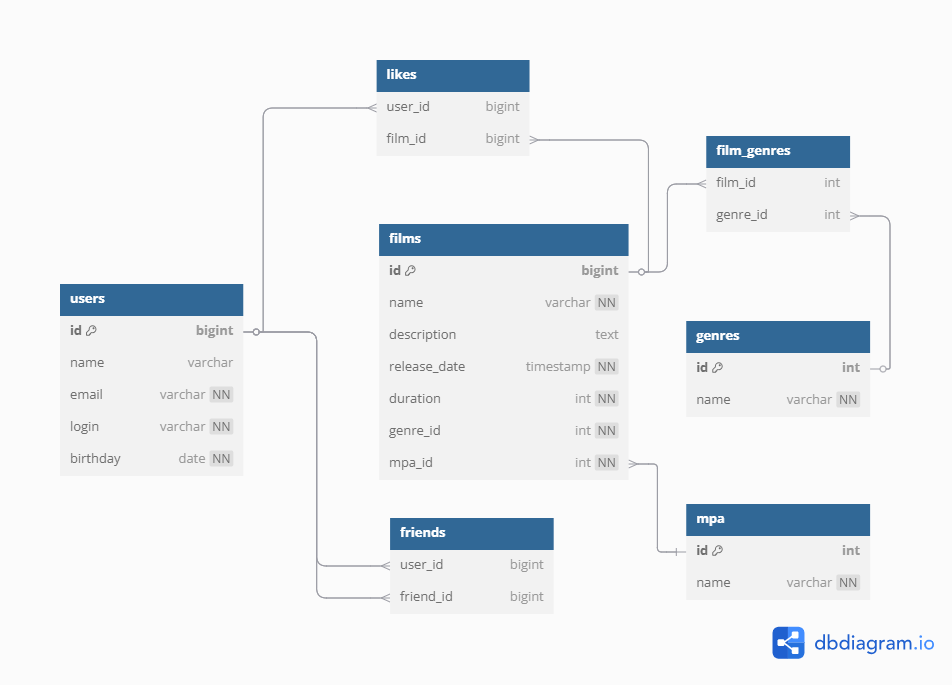

# java-filmorate
Template repository for Filmorate project.

## Database scheme:
   
   
## Basic requests:

### 1. Get all users
SELECT * 
FROM users;

### 2. Get all films
SELECT * 
FROM films;

### 3. Get user id=1:
SELECT * 
FROM users
WHERE id = 1;

### 4. Get film id=1:
SELECT *
FROM films
WHERE id = 1;
   
### 5. Get user's (id=1) friends
SELECT u.id AS friend_id, u.name AS friend_name, u.login AS friend_login, u.email AS friend_email, u.birthday AS friend_birthday
FROM friends AS f
INNER JOIN users AS u ON f.friend_id = u.id
WHERE f.user_id = 1

### 6. Get common friends (id=1, id=5)
SELECT u.id AS friend_id, u.name AS friend_name, u.login AS friend_login, u.email AS friend_email, u.birthday AS friend_birthday
FROM friendship f1
JOIN friendship f2 ON f1.friend_id = f2.friend_id 
JOIN users u ON f1.friend_id = u.id 
WHERE f1.user_id = 1 AND f2.user_id = 5;

### 7. Get 10 most pupular films:
SELECT f.id AS film_id, f.name AS film_name, COUNT(l.user_id) AS likes
FROM films AS f
LEFT JOIN likes AS l ON f.id = l.film_id
GROUP BY f.id, f.name 
ORDER BY likes DESC
LIMIT 10;
